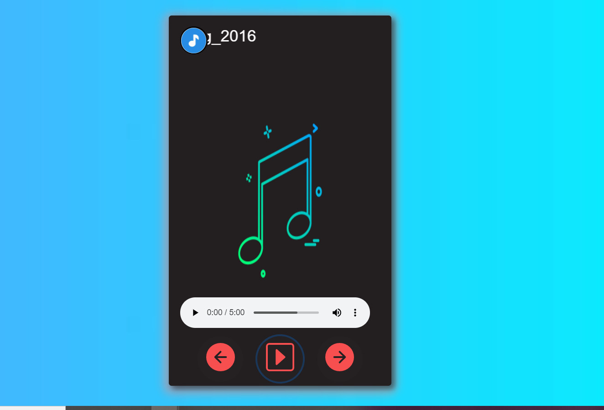

# js_mp3-pkayer

###  this was my first ever small web application  which tried using HTML , CSS, JavaScript. 
this application teach em how to use dom manipulations using javascript.I was begginer in JavaScript so learning new things and making a application using javaScript encouraged me to learn more about
web development, and explore more into the web javascript

## Few features to discuss ,

this is a single page songs app where we can play songs, download songs,

https://firozkhan7867.github.io/js_mp3-pkayer/mp3-player/html/music-player.htm

this is here working in live., plz check out , 

### Preview

